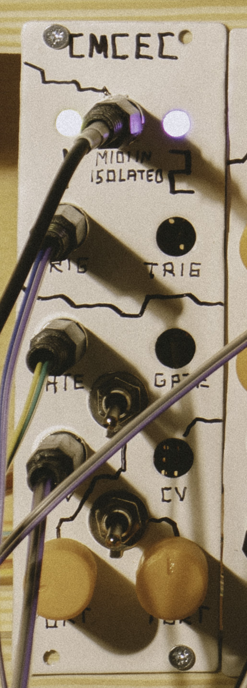
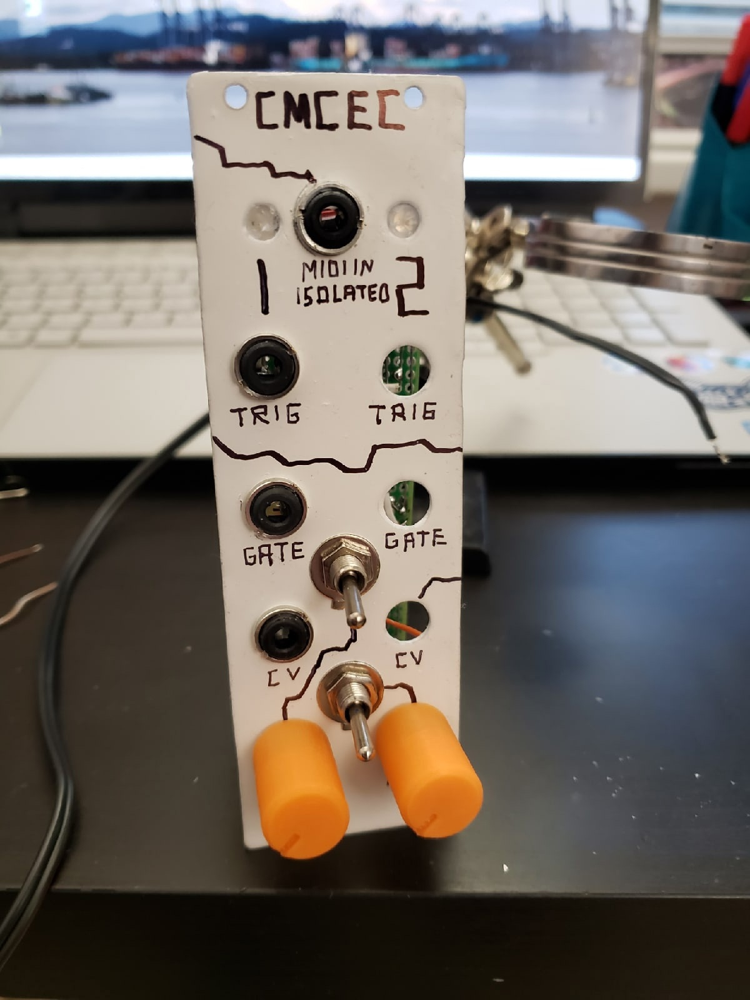
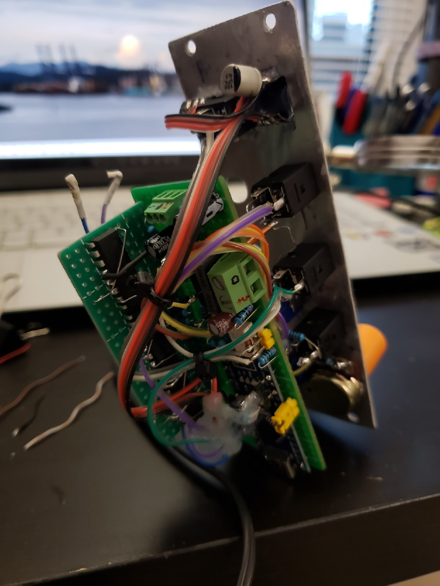
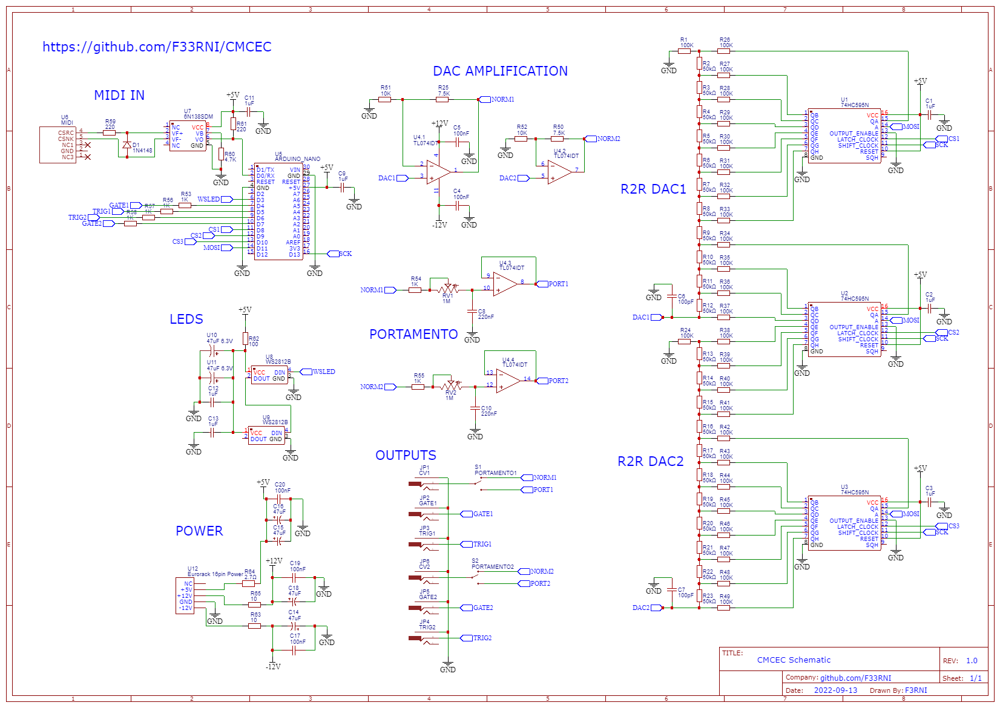
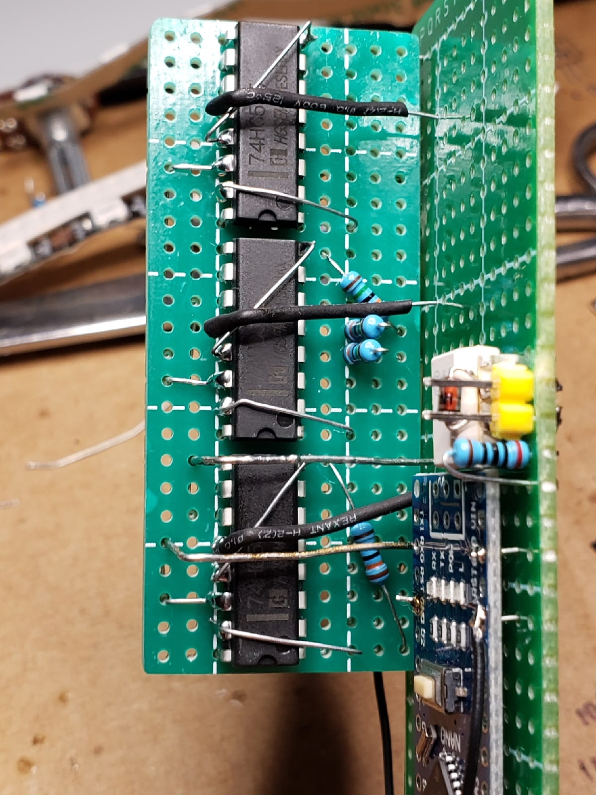
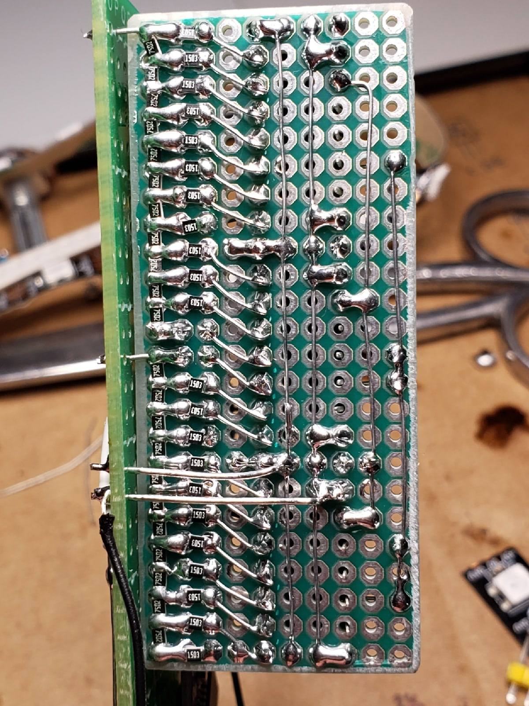

# CMCEC
## Cheap 2 channel MIDI to CV converter on 2x12bit R2R DAC with supply voltage compensation, analog portamento and optical isolation

    

        
        
        
    

    

        
        
        
    

----------

### Schematic

PDF-version available at the root of the repo

    

        
    

----------

### R2R DAC

To make this project as cheap as possible I decided to use DIY R2R DAC based on 74HC595 shift registers instead of buying one

    

        
        
    

